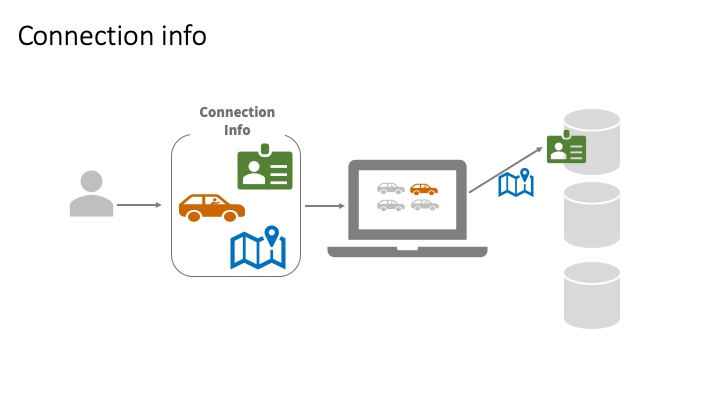

# ODBC connections with R and RStudio

This short webinar highlights the best pratices described at db.rstudio.com for
managing ODBC connections in R. This webinar uses a PostgreSQL database
containing data from the
[`nycflights13`](https://github.com/hadley/nycflights13) R package.

---

